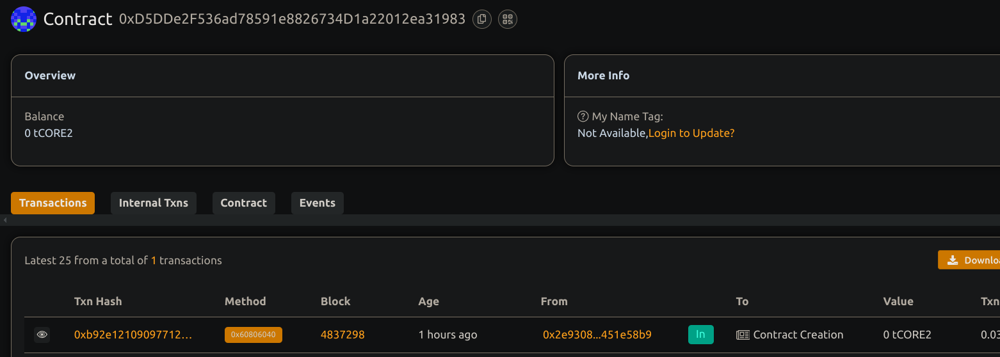

# 🌉 Cross-Chain Token Bridge (Basic Implementation)


## 🧠 Project Description


A basic cross-chain token bridge that allows users to lock tokens on one chain and release them on another. Designed for one-way bridging using off-chain event listeners.

## 🌍 Project Vision


Enable simple cross-chain transfers of tokens using a lock-and-mint (or lock-and-release) mechanism. This foundation can evolve into a multi-chain interoperability protocol.


## 🔑 Key Features


- Lock tokens on origin chain
- Emit events for off-chain relay
- Owner can release tokens on destination chain
- Protects against double-processing with txHash tracking


## 🚀 Future Scope


- Two-way bridge support
- Decentralized relayers
- Oracle integration for automated validation
- Multi-token bridging
- Zero-knowledge proofs for message passing

 
## 📜 Deployment Instructions


```bash
npm install
npx hardhat compile
npx hardhat run scripts/deploy.js --network <network>
```

## Contract details
0xD5DDe2F536ad78591e8826734D1a22012ea31983
project made my Nisha 
